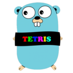

# <p align="center">RetroTetris</p>
<p align="center">
  
</p>

<p align="center">
  
  
  
  
</p>

RetroTetris merupakan game tetris sederhana yang merupakan hasil pengembangan ulang / modifikasi dari versi eny-fpc / sebut saja ENY yang bisa anda temukan repositorynya di [sini](https://github.com/eny-fpc/petris)

## Deskripsi
RetroTetris merupakan game arcade klasik yang dimana sering ditemukan pada Nintendo atau Gameboy jadul pada tahun tahun 90an sampe 2000an.

## Fitur
- Sederhana & Mudah dimainkan
- Gaya tampilan yang klasik dan sederhana
- Terdapat fitur level dan score
- Cukup tekan spasi untuk memainkannya

## How to Play
1. Silakan download terlebih dahulu dari Release atau dari folder Bin atau anda bisa compile sendiri menggunakan Lazarus
2. Silakan install / buka program yang telah didownload/install untuk mengerakan tetrominoes anda dapat menggunakan panah kiri, kanan, bawah
3. Cobalah untuk mencapai poin tertinggi dan jangan sampai kalah, jika anda kalah anda akan kena ejek [Awokawok]

# Tujuan
```text
Tujuan modifikasi / develop ulang ini adalah sebagai Tugas dari Matakuliah Komputer Grafik
```

## Dukungan OS
- Game ini Hanya Mendukung Sistem Operasi Windows dikarenakan ada menggunakan Windows API

## Lisensi
RetroTetris dilisensi dengan [MIT License](LICENSE).

## Ucapan Terimakasih / Special Thanks
- [Eny](https://github.com/eny-fpc)

## Screenshot
<p align="center">
    
</p>